# 五分钟学设计模式系列

```
@author: sdubrz
本文为B站视频学习笔记，原视频地址为https://www.bilibili.com/video/BV1af4y1y7sS/?spm_id_from=333.788.videocard.2

后根据《设计模式之禅》进行补充
```

## 01 单例模式

```
@date: 7/21/2020 11:20:07 PM 
```

+ Ensure a class has only one instance, and provide a global point of access to it.
+ 单例模式的主要作用是确保一个类只有一个实例存在。
+ 可用于序列号生成器、web页面的计数器等。
+ 如果创建某个对象需要消耗较多的资源的话，比如访问IO、或者数据库资源的时候也可以使用单例模式。

### 例子

+ 构造方法必须是私有的（private）
+ 拥有一个唯一的实例，即它的类变量，是静态的（static）
+ 实现可以分为两种：懒汉式实现和饿汉式实现
	+ 懒汉式实现：在第一次使用的时候实例化，需要加锁防止被多次实例化。
	+ 饿汉式实现：类一开始加载的时候就实例化。

下面是一个简单的例子示意

```
public class SingletonPattern {
    public static void main(String[] args){

    }
}

class Singleton{
    private static Singleton singleton = new Singleton();  // 饿汉式实现，类加载的时候实例化
    private Singleton(){

    }

    public static Singleton getInstance(){
        return singleton;
    }
}
```

```
public class SingletonPattern {
    public static void main(String[] args){

    }
}

class Singleton{
    private static Singleton singleton;
    private Singleton(){

    }

    public static Singleton getInstance(){
        singleton = new Singleton();  // 懒汉式实现，在第一次使用的时候实例化。
									//需要加锁，这里只是个示意
        return singleton;
    }
}
```

## 02 简单工厂模式

```
@date: 7/21/2020 11:46:24 PM 
```

+ **简单工厂模式**（Simple Factory Pattern）：又称为**静态工厂方法**（Static Factory Method），它属于创建型模式。在简单工厂模式中，可以根据参数的不同返回不同类的实例。简单工厂模式专门定义一个类来负责创建其他类的实例，被创建的实例通常都具有共同的父类。
+ 有一个工厂类，根据参数决定返回不同类的实例。这些类一般属于同一个大类。
+ 下面是简单工厂模式的一个类图
	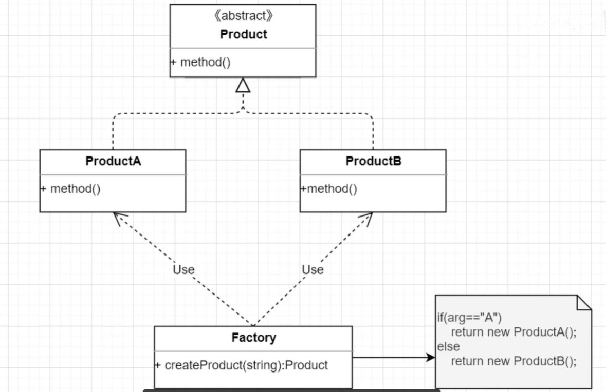
+ 下面是简单工厂模式的一个例子

```
/**
 * 简单工厂模式
 */
public class SimpleFactory {

    public static Product createProduct(String type){
        if(type.equals("A")){
            return new ProductA();
        }else{
            return new ProductB();
        }
    }

    public static void main(String[] args) {
        Product product = SimpleFactory.createProduct("A");
        product.information();
    }
}

abstract class Product{
    public abstract void information();
}

class ProductA extends Product{

    @Override
    public void information() {
        System.out.println("product A");
    }
}

class ProductB extends Product{

    @Override
    public void information() {
        System.out.println("product B");
    }
}
```

+ 简单工厂模式的优点：
	+ 实现了对象的创建和使用的分离。把创建交给工厂类负责，客户端程序员不必关心怎么创建，只需要关心如何使用。
+ 简单工厂类的缺点：
	+ 工厂类不够灵活。如果我们新增一个产品类型，就需要修改工厂类，需要修改其判断模式。

## 03 工厂模式

```
@date: 7/22/2020 11:36:17 PM 暴雨红色预警
```

+ **开闭原则**：程序对扩展是开放的，对于修改是封闭的。简单工厂模式每次新增产品类型都需要修改工厂类，不符合开闭原则。
+ **工厂模式**：定义一个用于创建对象的接口，让子类决定实例化哪个类。工厂方法使一个类的实例化延迟到其子类。 Define an interface for creating an object, but let subclasses decide which class to instantiate. FactoryMethod lets a class defer instantiation to subclasses.
+ 下面是工厂模式的类图。工厂类是一个抽象类（或接口）

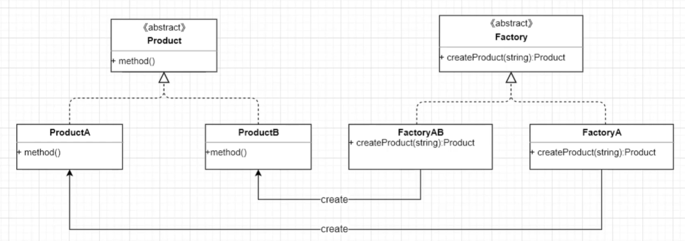

+ JDK中的Collection中的Iteration的生成就是用的工厂模式。
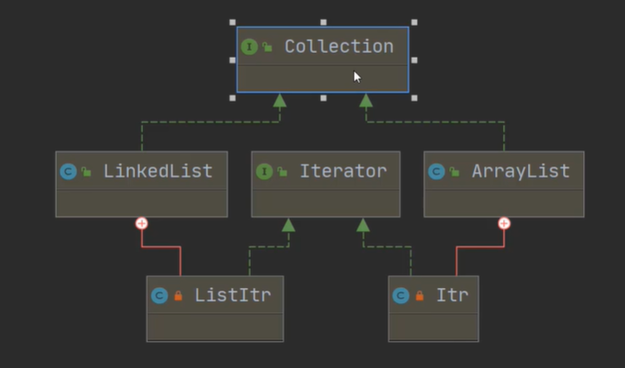

## 04 抽象工厂模式

```
@date: 7/22/2020 11:50:34 PM 
```

+ 抽象工厂模式与工厂模式十分类似。在原有的工厂模式中，所有的产品都属于同一个大类，具体的工厂子类实现生产某一种产品。而抽象工厂模式中扩展了具体工厂的功能，使其可以生产多个大类的产品。
+ 抽象工厂模式的类图
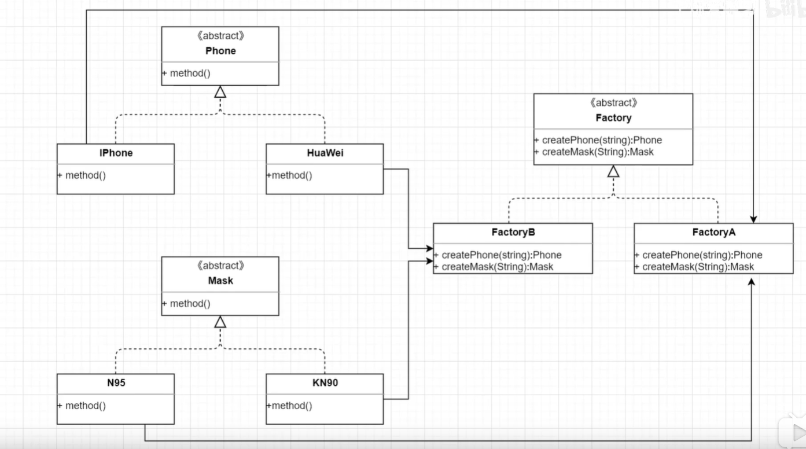

+ 如果新增产品体系，必须重新修改抽象工厂类和具体工厂类，因而违反了开闭原则。

## 05 装饰器模式

```
@date: 7/23/2020 6:34:23 PM 
```

+ 动态地给一个对象添加一些额外的功能。就增加功能来说，装饰模式比生成子类更加灵活。 
+ 不同于继承原来的类，在子类中扩展功能，装饰器模式只需要一个原来类的对象即可，下面是装饰器模式的类图。

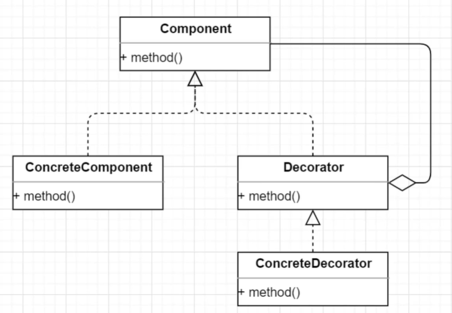

+ 下面是一个装饰器模式的简单代码例子

```
public class DecoratorPattern {
    public static void main(String[] args) {
        new RobotDecorator(new FirstRobot()).doMoreThing();
    }
}

interface Robot{
    void doSomething();
}

class FirstRobot implements Robot{
// 通过继承方式扩展
    @Override
    public void doSomething() {
        System.out.println("talk");
        System.out.println("sing");
    }
}

class RobotDecorator implements Robot{
    // 用装饰器进行扩展
    private Robot robot;
    public RobotDecorator(Robot robot){
        this.robot = robot;
    }

    @Override
    public void doSomething() {
        robot.doSomething();
    }

    public void doMoreThing(){
        robot.doSomething();  // 可以做原来的事情
        System.out.println("dance");  // 也可以做一些新的事情
    }
}

```

+ Java中IO流大量使用了装饰器模式


## 06 适配器模式

```
@date: 7/23/2020 6:54:26 PM 
```
+ 将一个类的接口变换成客户端所期待的另一种接口，从而使原本因接口不匹配而无法再一起工作的两个类能够在一起工作。
+ 下面是适配器模式的类图。其通常有两种实现的方式
	+ 通过关联的形式实现。将原类的一个实例作为适配器类中的一个变量。
	+ 通过继承的形式实现。通过继承原来的类，并进行扩展。

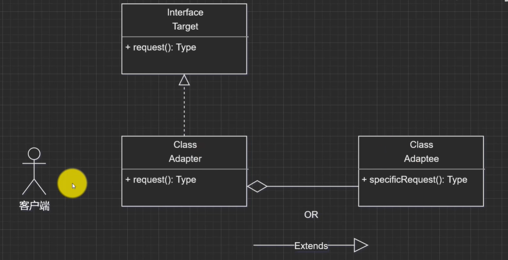

+ 与装饰器模式的区别：
	+ 首先目的不同。适配器模式中原有的接口没有太大的问题，只是与客户端不兼容，适配器只是提供一个转换的作用，不会改变原有接口。而装饰器模式是为了对原有接口进行功能扩展，所以说需要修改原有的接口。
	+ **不太形象，最好再查阅一些其他的材料**

## 07 观察者模式

```
@date: 7/23/2020 7:16:07 PM 
```

+ 观察者模式（Observer Pattern）又称为**发布-订阅**模式。定义对象间的一种一对多依赖关系，使得每当一个对象状态发生改变时，其相关依赖对象皆得到通知并被自动更新。
+ 下面是一个实现的例子，这里面的credit就是观察者。

```
import java.util.*;

/**
 * 观察者模式
 */
public class ObserverPattern {
    public static void main(String[] args) {
        Debit zhangSan = new ZhangSan();
        zhangSan.borrow(new WangEr());
        zhangSan.borrow(new LiSi());

        // state发生改变
        zhangSan.notifyCredit();
    }
}

interface Debit{
    // 借款方接口
    void borrow(Credit credit);  // 向credit借钱
    void notifyCredit();  // 通知所有债主
}

class ZhangSan implements Debit{
    private List<Credit> allCredits = new ArrayList<>();
    private Integer state = 0;  // 1表示有钱

    @Override
    public void borrow(Credit credit) {
        allCredits.add(credit);
    }

    @Override
    public void notifyCredit() {  // 通知所有人来取钱
        allCredits.forEach(credit -> credit.takeMoney());
    }
}

interface Credit{
    void takeMoney();
}

class LiSi implements Credit{

    @Override
    public void takeMoney() {
        System.out.println("李四要钱");
    }
}

class WangEr implements Credit{

    @Override
    public void takeMoney() {
        System.out.println("王二要钱");
    }
}
```

## 08 外观模式

```
@date: 7/23/2020 10:49:14 PM 
```

+ 要求一个子系统的外部与其内部的通信必须通过一个统一的对象进行。外观模式提供一个高层次的接口，使得子系统更易使用。
+ 下面是外观模式的类图

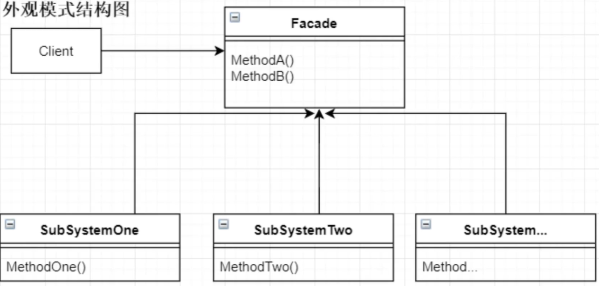

+ 下面是一个外观模式的代码例子

```
/**
 * 外观模式 Facade Pattern
 */
public class FacadePattern {
    public static void main(String[] args) {
        new Facade().prove();
    }
}

class SubFlow1{
    boolean isTrue(){
        return true;
    }
}

class SubFlow2{
    boolean isOK(){
        return true;
    }
}

class SubFlow3{
    boolean isGood(){
        return true;
    }
}

class Facade{
    SubFlow1 s1 = new SubFlow1();
    SubFlow2 s2 = new SubFlow2();
    SubFlow3 s3 = new SubFlow3();

    boolean prove(){
        return s1.isTrue() && s2.isOK() && s3.isGood();
    }
}

```

+ 外观模式的缺点是违反了开闭原则，当增加子类时，需要修改外观类。


## 09 状态模式

```
@date: 7/23/2020 11:02:24 PM 
```

+ 状态模式（State Pattern）：允许一个对象在其内部状态改变时改变它的行为，对象看起来似乎修改了它的类。其别名为状态对象（Objects of States），状态模式是一种对象行为型模式。
+ 可用来替代那种多个 if-else 的情况。
+ 下图是状态模式的类图

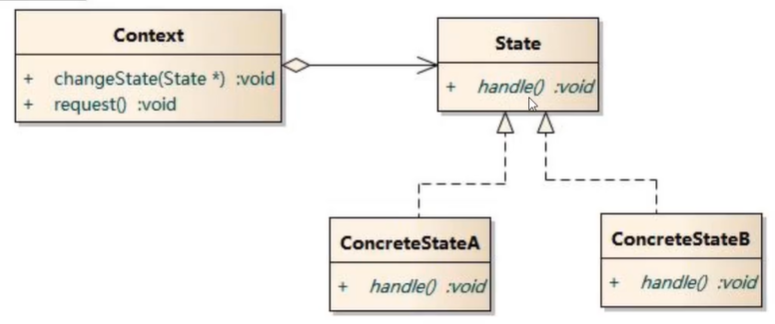

+ 下面是一个Java程序的例子

```
/**
 * 状态模式  State Pattern
 */
public class StatePattern {
    public static void main(String[] args) {
        Context zhangSan = new Context();
        zhangSan.changeState(new Happy());
        zhangSan.doSomething();
        zhangSan.changeState(new Sad());
        zhangSan.doSomething();
    }
}

abstract class State{
    abstract void doWork();
}

class Happy extends State{

    @Override
    void doWork() {
        System.out.println("积极主动");
    }
}

class Angry extends State{

    @Override
    void doWork() {
        System.out.println("无精打采");
    }
}

class Sad extends State{

    @Override
    void doWork() {
        System.out.println("啥也不干");
    }
}

class Context{
    private State state;
    public void changeState(State state){
        this.state = state;
    }

    public void doSomething(){
        state.doWork();
    }
}

```

## 10 模板方法模式（Template Method Pattern）

+ Define the skeleton of an algorithm in an operation, deferring some steps to subclasses. Template Method lets subclasses redefine certain steps of an algorithm without changing the algorithm's structure. 定义一个操作中的算法框架，而将一些步骤延迟到子类中。使得子类可以不改变一个算法结构即可重定义该算法的某些特定步骤。
+ 为防止恶意的操作，一般模板方法都加上final关键字，不允许被覆写。
+ 模板方法模式的优点：
	+ 封装不变部分，扩展可变部分。把认为是不变部分的算法封装到父类实现，而可变部分则可以通过继承来继续扩展。
	+ 提取公共部分代码，便于维护。
	+ 行为由父类控制，子类实现。基本方法是由子类实现的，因此子类可以通过扩展的方式增加相应的功能，符合开闭原则。
+ 模板方法模式的缺点
	+ 按照我们的设计习惯，抽象类负责声明最抽象、最一般的事务属性和方法，实现类完成具体的事务属性和方法。但是模板方法模式却颠倒了，抽象类定义了部分抽象方法，由子类实现，子类执行的结果影响了父类的结果，也就是子类对父类产生了影响，这在复杂的项目中，会带来代码阅读的难度，而且也会让新手产生不适感。

+ 下面是一个模板方法模式的例子

```
public class TemplateMethodClass {

    public static void main(String[] args) {
        AbstractClass obj1 = new ConcreteClass1();
        AbstractClass obj2 = new ConcreteClass2();
        obj1.templateMethod();
        obj2.templateMethod();
    }
}

abstract class AbstractClass{
    // 基本方法
    protected abstract void doSomething();
    protected abstract void doAnything();

    // 模板方法
    public void templateMethod(){
        // 调用基本方法完成相关逻辑
        this.doAnything();
        this.doSomething();
    }
}

class ConcreteClass1 extends AbstractClass{
    @Override
    protected void doSomething() {
        System.out.println("Do something 1");
    }

    @Override
    protected void doAnything() {
        System.out.println("Do anything 1");
    }
    // 实现基本方法
}

class ConcreteClass2 extends AbstractClass{
    @Override
    protected void doSomething() {
        System.out.println("Do something 2");
    }

    @Override
    protected void doAnything() {
        System.out.println("Do anything 2");
    }
    // 实现基本方法
}

```

## 11 建造者模式

+ 建造者模式（Builder pattern）也叫做生成器模式，其定义为 Separate the construction of a complex object from its representation so that the same construction process can create different representations. 将一个复杂对象的构建与它的表示分离，使得同样的构建过程可以创建不同的表示。
+ 下图是建造者模式的通用类图

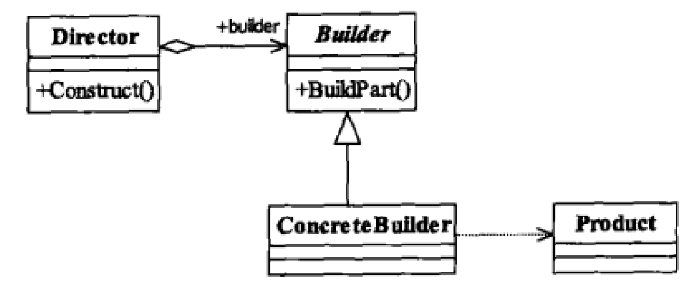

+ 在建造者模式中，有如下四个角色：
	+ **Product产品类**：通常是实现了模板方法的模式，也就是有模板方法和基本方法。
	+ **Builder抽象建造者**：规范产品的组建，一般是由子类实现。
	+ **ConcreteBuilder具体建造者**：实现抽象类定义的所有方法，并且返回一个组建好的对象。
	+ **Director导演类**：负责安排已有模块的顺序，然后告诉Builder开始建造。

+ 建造者模式的优点：
	+ **封装性**。使用建造者模式可以使客户端不必知道产品内部组成的细节。
	+ **建造者独立，容易扩展**。
	+ **便于控制细节风险**。由于具体的建造者是独立的，因此可以对建造过程逐步细化，而不对其他的模式产生任何影响。

+ 建造者模式的使用场景
	+ 相同的方法，不同的执行顺序，产生不同的时间结果时，可以采用建造者模式。
	+ 多个部件或零件，都可以装配到一个对象中，但是产生的运行结果又不相同时，则可以使用该模式。
	+ 产品类非常复杂，或者产品类中的调用顺序不同产生了不同的效能，这个时候使用建造者模式非常合适。
	+ 在对象创建过程中会使用到系统中的一些其他对象，这些对象在产品对象的创建过程中不易得到时，也可以采用建造者模式封装该对象的创建过程。该中场景只能是一个补偿方法，因为一个对象不容易获得，而在设计阶段竟然没有发觉，而要通过创建者模式柔化创建过程，本身已经违反设计的最初目标。

+ **与工厂模式比较**：建造者模式最主要的功能是基本方法的调用顺序安排，也就是这些基本方法已经实现了，通俗地说就是零件的装配，顺序不同产生的对象也不同；而工厂方法则重点是创建，创建零件是它的主要职责，组装顺序则不是它关心的。

## 12 代理模式

+ 代理模式（Proxy Pattern）：Provide a surrogate or placeholder for another object to control access to it. 为其他对象提供一种代理以控制对这个对象的访问。
+ 代理模式又称委托模式。许多其他的模式，如状态模式、策略模式、访问者模式本质上是在更特殊的场合采用了委托模式。
+ 代理模式的通用类图如下：

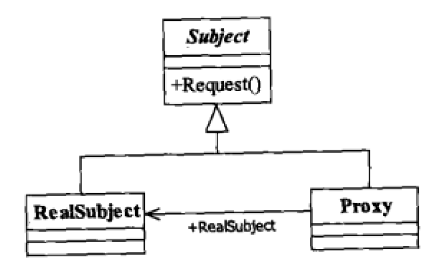

其中

+ + **Subject抽象主题角色**：抽象主题类可以使抽象类也可以是接口，是一个最普通的业务类型定义，无特殊要求。
 + **RealSubject具体主题角色**。也叫做被委托角色、被代理角色。它才是冤大头，是业务逻辑的具体执行者。
 + **Proxy代理主题角色**。也叫做委托类、代理类。它负责对真实角色的应用，把所有抽象主题类定义的方法限制委托给真实主题角色实现，并且在真实主题角色处理完毕前后座预处理和善后处理工作。

+ 下面是一个代码模板

```
// 抽象主题类
interface Subject{
    public void request();
}

// 真实主题类
class RealSubject implements Subject{

    @Override
    public void request() {
        System.out.println("Real subject request");
    }
}

// 代理类
class Proxy implements Subject{

    private Subject subject = null;  // 要代理哪个实现类

    // 默认被代理者
    public Proxy(){
        this.subject = new Proxy();
    }

    // 通过构造函数传递代理者
    public Proxy(Object objects){

    }

    // 实现接口中的定义方法
    @Override
    public void request() {
        this.before();
        this.subject.request();
        this.after();
    }

    // 预处理
    private void before(){
        System.out.println("预处理");
    }

    // 善后处理
    private void after(){
        System.out.println("善后处理");
    }
}

``` 

### 代理模式的扩展

#### 普通代理

+ 普通代理的要求是客户端只能访问代理角色，而不能访问真实角色。其类图如下所示 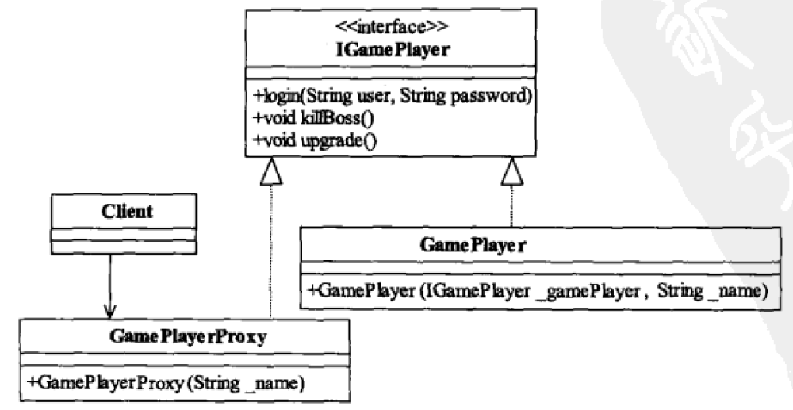

#### 强制代理

+ 强制代理“强制”你必须通过真实角色查找到代理角色，否则你不能访问。如你跟明星打电话时，他让你找他的经纪人。下面是强制代理模式的类图：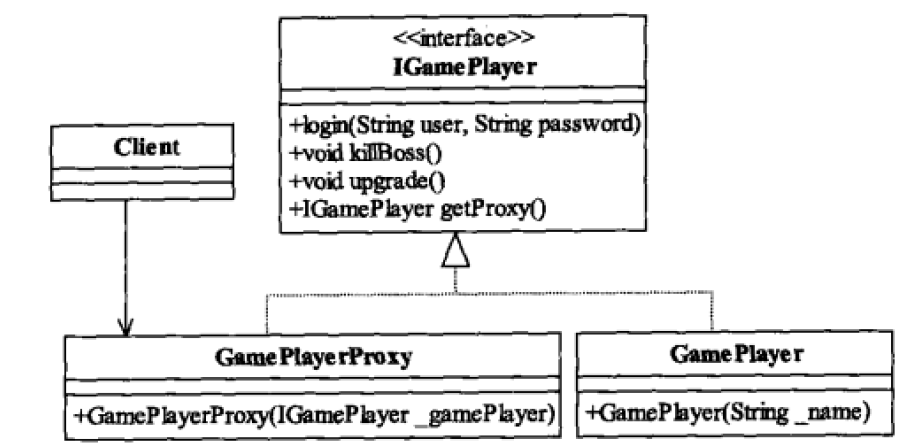

#### 虚拟代理

+ 在需要的时候才初始化主题对象，可以避免被代理对象较多而引起的初始化缓慢的问题。其缺点是需要在每个方法中判断主题对象是否被创建，这就是虚拟代理(Virual Proxy) 。

#### 动态代理

``暂略``

## 13 原型模式

```
@date: 8/4/2020 5:28:33 PM 
```

+ 原型模式（Prototype Pattern）：Specify the kinds of objects to create using a prototypical instance, and create new objects by copying this prototype. 用原型实例指定创建对象的种类，并且通过拷贝这些原型创建新的对象。
+ Java JDK中的Cloneable接口中一个方法也没有，这个接口只是起一个标记的作用，标示这个对象时可以拷贝的。
+ 原型模式的优点：
	+ **性能优良**。原型模式是在内存二进制流的拷贝，要比直接new一个对象性能好很多，特别是要在一个循环体内产生大量的对象时，原型模式可以更好地体现其优点。
	+ **逃避构造函数的约束**。这既是它的优点也是缺点，直接在内存中拷贝，构造函数是不会执行的。优点是减少了约束，缺点也是减少了约束，需要大家在实际应用时考虑。*这个缺点没看懂*
+ 原型模式的使用场景
	+ **资源优化场景。**类初始化需要消化非常多的资源，这个资源包括数据、硬件资源等。
	+ **性能和安全要求的场景**。通过new产生一个对象需要非常繁琐的数据准备或访问权限，则可以使用原型模式。
	+ **一个对象多个修改者的场景**。一个对象需要提供给其他对象访问，而且各个调用者可能都需要修改其值时，可以考虑使用原型模式拷贝多个对象供调用者使用。
	+ 在实际项目中，原型模式很少单独出现，一般是和工厂方法模式一起出现，通过clone方法创建一个对象，然后由工厂方法提供给调用者。
+ Object类的clone方法的原理是从内存中（具体地说就是堆内存）以二进制流的方式进行拷贝，重新分配一个内存块，所以clone的时候不会再执行构造方法。
+ 要使用clone方法，类的成员变量上不要增加final关键字。

## 14 中介者模式

```
@date: 8/4/2020 8:06:17 PM 
```

+ Define an object that encapsulates how a set of objects interact. Mediator promotes loose coupling by keeping objects from referring to each other explicitly, and it lets you vary their interaction independently. 用一个中介对象封装一系列的对象交互，中介者使各对象不需要显示地相互作用，从而使其耦合松散，而且可以独立的改变它们之间的交互。


